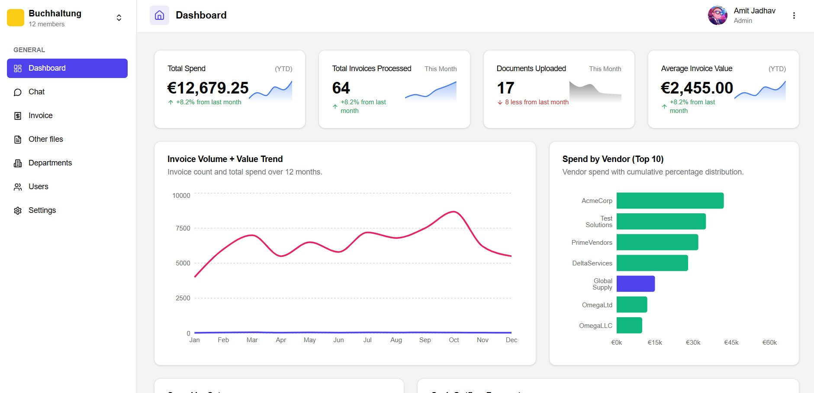
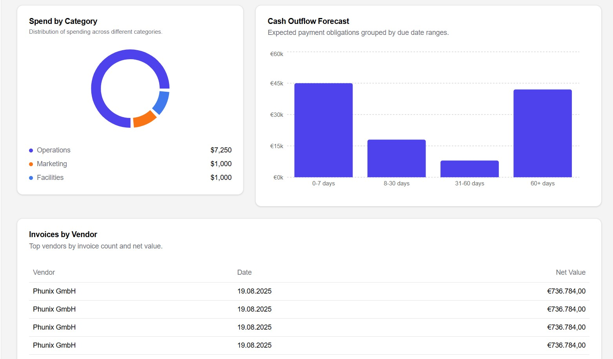
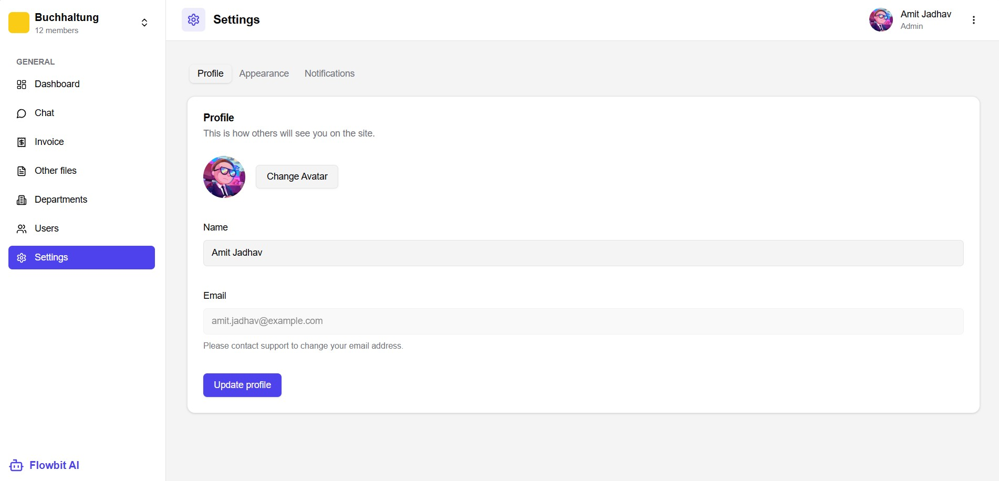

<!-- Badges -->
<div align="center">

# 🚀 Flowbit AI Dashboard

A production-grade dashboard built for **Flowbit Private Limited (Internship Assignment)** — scalable, responsive, and production ready.

[](https://flowbit-ai-dashboard.vercel.app/)
[](https://github.com/Himanshu4812/flowbit_ai_dashboard/stargazers)
[](https://github.com/Himanshu4812/flowbit_ai_dashboard/network/members)
[](#license)

</div>

---

🔗 **Live Demo:** https://flowbit-ai-dashboard.vercel.app/  
📦 **GitHub Repo:** https://github.com/Himanshu4812/flowbit_ai_dashboard

---

## 📸 Screenshots

### ✅ Dashboard Overview


### ✅ Charts & Analytics


### ✅ Profile Section



---

## 🧩 Features

- 🔐 **Authentication** (Clerk Auth / Custom Backend / JWT)
- 📊 **Dynamic charts & analytics** using Recharts
- 🧱 **Modular and reusable component architecture**
- 🎨 **Modern UI** (shadcn/ui + Tailwind CSS)
- ⚡ **Vite + React + TypeScript**
- 🌙 **Dark / Light theme toggle**
- 📱 **Fully responsive for all devices**
- 🚀 **Deployed on Vercel**

---

## 🛠️ Tech Stack

| Category     | Technology Used                 |
|--------------|----------------------------------|
| Frontend     | React + TypeScript + Vite        |
| Styling      | Tailwind CSS + shadcn/ui         |
| Charts       | Recharts                         |
| Auth         | Clerk / Custom backend auth      |
| Deployment   | Vercel                           |

---

## 🔧 Setup Instructions

### 1. Clone the repository
```sh
git clone https://github.com/Himanshu4812/flowbit_ai_dashboard.git
cd flowbit_ai_dashboard
```
### 2. Install dependencies
```sh
npm install
```

### 3. Add environment variables
```sh
VITE_CLERK_PUBLISHABLE_KEY=your_key_here
VITE_API_URL=https://your-backend-url
```

### 4. Run the project
```sh
npm run build
```

### 5. Build for production
```sh
npm run build
```

---

## 🗂️ Project Structure
```markdown
src/
 ├─ components/          # Reusable UI components
 ├─ pages/               # Route-based pages
 ├─ hooks/               # Custom React hooks
 ├─ context/             # Global providers
 ├─ utils/               # Helper utilities
 └─ assets/              # Static assets (images/icons)
```
---

## 🚀 Deployment (Vercel)
1. Push project to GitHub
2. Go to https://vercel.com → "New Project"
3. Import the repo
4. Add environment variables (.env values)
5. Deploy ✅

---

### ✅ Improvements Made
1. Removed .env from Git history for security
2. Production-ready file structure
3. Deployed with CI/CD using Vercel
4. Clean & well-documented repository

---

### 📌 Roadmap
☑ Add unit tests (Vitest + React Testing Library)
⏳ Role-based dashboard
⏳ Real API integration with filtering

---

## 🧑‍💻 Author
#### Himanshu
GitHub: [https://github.com/Himanshu4812](https://github.com/Himanshu4812) <br>
LinkedIn: [https://linkedin.com/in/himanshu](https://www.linkedin.com/in/himanshu-kumar-389a85273/)

### ⭐ Support
If this helped or inspired you, please give a star ⭐ on GitHub — it motivates me to build more!

